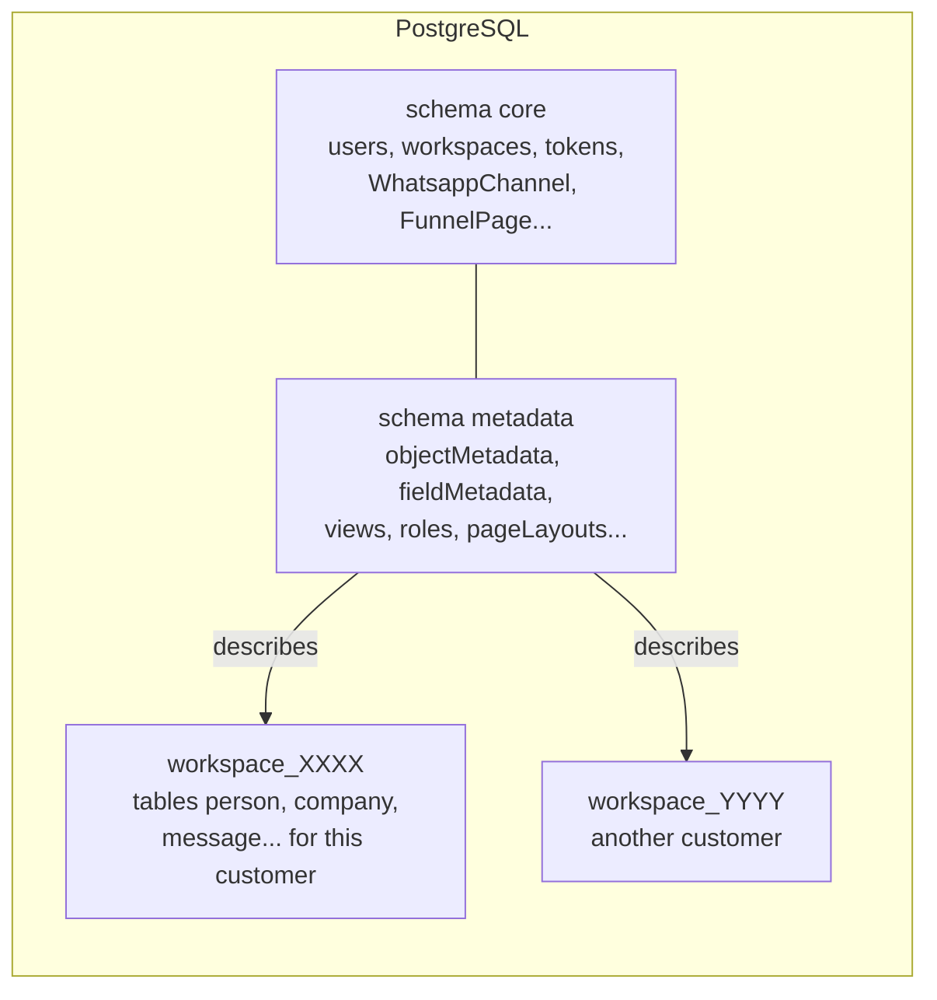
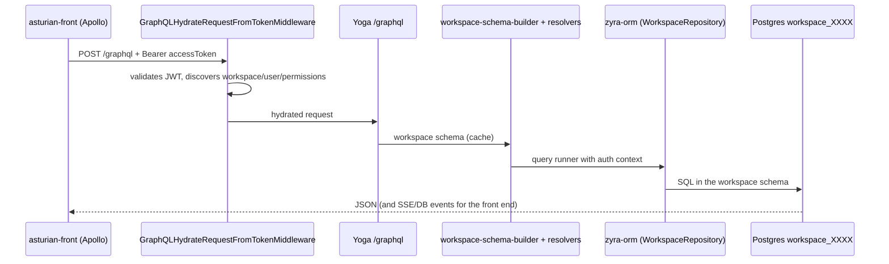
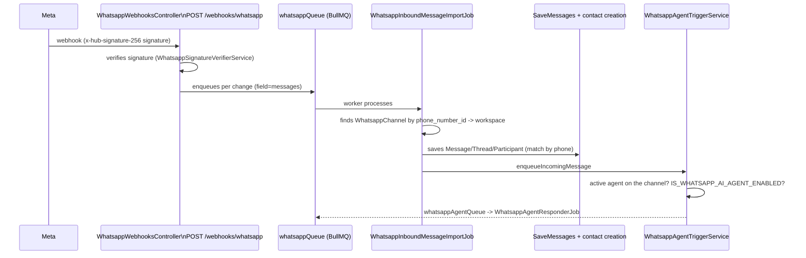

# How Zyra works

Quick guide for anyone who just joined the team (dev or product). Everything here was checked against the code; where something comes only from the project's operational memory or from a plan that isn't implemented yet, that is stated.

> Name: the product is a white-label CRM (fork of Zyra/Twenty). The UI still says "Zyra"; the brand is swapped at build time via `ZYRA_BRAND` (see [Brand](#white-label-brand)). The internal packages still use the `zyra-*` prefix, except the front end, renamed to `asturian-front`.

## 1. Overview and stack

Multi-tenant CRM: each customer (workspace) has its own objects (People, Companies, Opportunities, Tasks, Notes, Messages...) and the data model is **configurable at runtime**, not fixed in the code.

| Layer | Technology |
|---|---|
| Frontend | React 18, TypeScript, Jotai (state), Linaria (CSS-in-JS), Apollo Client, Vite |
| Backend | NestJS, TypeORM, PostgreSQL, Redis, GraphQL (Yoga, code-first) |
| Jobs | BullMQ (on top of Redis) |
| Monorepo | Nx + npm workspaces |
| Analytics | ClickHouse (optional) |

## 2. Package map

```
packages/
├── zyra-server/          NestJS API + worker (the heart)
├── asturian-front/       React CRM app (formerly zyra-front)
├── zyra-ui/              Shared visual component library
├── zyra-shared/          Common types, enums and utils (front + back)
├── zyra-emails/          Transactional email templates (React Email)
├── zyra-website/         Marketing site/landing (Vite + SSR entry)
├── zyra-docs/            Public documentation (Mintlify)
├── zyra-funnel/          Static build only (assets) of the funnel pages
├── zyra-front-component-renderer/  Another package; NOT the front end (don't confuse them)
├── zyra-sdk, zyra-client-sdk, zyra-cli, create-zyra-app, zyra-apps  SDK/CLI for apps
├── zyra-oxlint-rules/    Custom lint rules (includes module boundaries)
├── zyra-zapier, zyra-companion, zyra-codex-plugin, zyra-claude-skills
├── zyra-docker/          Development Compose setup
├── zyra-utils/           Scripts (e.g. setup-dev-env.sh)
└── zyra-e2e-testing/     Playwright
```

Other directories at the root: `brands/` (white-label brands), `scripts/` (Vercel build/deploy), `api/index.js` (serverless entrypoint), `docs/` (this folder), `patches/`.

## 3. Backend: how it's organized

Code in `packages/zyra-server/src`:

```
main.ts / bootstrap-app.ts   sobe o servidor HTTP (createApp)
serverless.ts                entrypoint para Vercel (mesmo createApp)
queue-worker/                processo separado que consome as filas BullMQ
command/                     CLI Nest (comandos de banco/upgrade/cron)
database/                    TypeORM core, ClickHouse, comandos de banco
engine/                      infraestrutura genérica (o "framework" do CRM)
modules/                     regras de negócio (messaging, whatsapp, person...)
```

### `engine/` (platform)

| Folder | Role |
|---|---|
| `engine/core-modules/` | **core** schema entities: auth, user, workspace, billing, message-queue, zyra-config (environment variables), feature-flag, file, etc. |
| `engine/metadata-modules/` | Per-workspace metadata definitions: `object-metadata`, `field-metadata`, `view`, `page-layout*`, `role*`, `message-channel`, `whatsapp-channel/agent/template`, `funnel-page`, `webhook`, etc. Many have a `flat-*` version (flattened cache). |
| `engine/api/` | API layers: `graphql/` (core, metadata, admin-panel), `rest/`, `mcp/` |
| `engine/zyra-orm/` | Custom ORM on top of TypeORM, scoped by workspace (repositories, entity-manager, query-runner, schema-manager) |
| `engine/workspace-manager/` | Creates/migrates each workspace's schema and applies the "standard application" (default objects) |
| `engine/workspace-cache/` and `workspace-cache-storage/` | Metadata cache in Redis |
| `engine/guards/`, `engine/middlewares/` | Authentication/permission per request |

### `modules/` (business)

`person`, `company`, `opportunity`, `task`, `note`, `messaging`, `calendar`, `connected-account`, `match-participant`, `contact-creation-manager`, `whatsapp`, `whatsapp-webhooks`, `whatsapp-agent`, `instagram*`, `emailing`, `voice-agent`, `workflow`, `dashboard`, `timeline`, `attachment`, `blocklist`, among others. All registered in `modules/modules.module.ts`.

## 4. Multi-tenant and metadata model

This is the core idea. Three "layers" in the same Postgres:



- **core**: platform data (users, workspaces, API keys, tokens). Regular TypeORM entities in `engine/core-modules` and `engine/metadata-modules/*/entities`.
- **metadata**: describes *which objects and fields exist* in each workspace.
- **workspace_<uuid in base36>**: one Postgres schema per workspace with the actual data tables. The name comes from `engine/workspace-datasource/utils/` (`workspace_${uuidToBase36(workspaceId)}`).

### Objects and fields are dynamic

- The default objects (Person, Company, Message...) are declared as `*.workspace-entity.ts` in `modules/*/standard-objects/` and applied by `engine/workspace-manager/zyra-standard-application`.
- Custom objects/fields created by the user turn into records in `objectMetadata`/`fieldMetadata`; `workspace-migration` generates the DDL (create table/column) in the workspace schema.
- The **data GraphQL schema is generated per workspace** from this metadata: `engine/api/graphql/workspace-schema-builder` (types) + `workspace-resolver-builder` (resolvers) + `workspace-schema.factory.ts`. That's why `/graphql` changes depending on the workspace and the metadata cache is invalidated via `workspace-metadata-version`.

### Two GraphQL endpoints (important)

Defined in `app.module.ts` (middlewares per route `graphql`, `metadata`, `admin-panel`, `mcp`):

| Endpoint | What it is | Examples |
|---|---|---|
| `/graphql` | Workspace **data** API (dynamic schema) | create/list people, companies, messages |
| `/metadata` | **Platform/metadata** API (static schema) | login (`getLoginTokenFromCredentials`), `renewToken`, `currentUser`, `funnelPages`, `myWhatsappTemplates`, create objects/fields/views |
| `/admin-panel` | Server admin panel | |
| `/mcp` | MCP server | |
| REST | `engine/api/rest` (core and metadata) | |

Proven pitfall: testing an auth/funnel/template operation on `/graphql` gives "Cannot query field..." even with the server up to date. Probe `/metadata`.

## 5. Flow of a request (front end to database)



1. The front end (Apollo, `packages/asturian-front/src/modules/apollo`) sends the access token.
2. `engine/middlewares/graphql-hydrate-request-from-token.middleware.ts` calls `MiddlewareService.hydrateGraphqlRequest` and injects workspace/user into the request.
3. The workspace schema comes from the cache (`workspace-cache`), built from the metadata.
4. Resolvers use the `zyra-orm` (`GlobalWorkspaceOrmManager`, `WorkspaceScopedRepository`), always with an `AuthContext` (user, API key, application, or system). Jobs use `buildSystemAuthContext(workspaceId)`.
5. Side effects become events (`workspace-event-emitter`) that trigger listeners, webhooks, workflows, and jobs.

## 6. Frontend (`asturian-front`)

In `packages/asturian-front/src`:

- `modules/` by domain (`object-record`, `object-metadata`, `views`, `page-layout`, `settings`, `auth`, `funnel`, `people`, `companies`, `workflow`, `ai`...). `pages/` are the route screens (`auth`, `funnel`, `object-record`, `onboarding`, `settings`, `page-layout`).
- **Client-side metadata**: `modules/metadata-store` holds objects/fields/views coming from `/metadata`; the record UI is built from them, with no fixed screens per object.
- **Page layouts / widgets**: `modules/page-layout` (widgets in `page-layout/widgets/`: emails, timeline, calendar, fields, etc.) lets you configure each object's detail page. Widget types live in `zyra-shared` and, on the backend, in `engine/metadata-modules/page-layout-widget`.
- Global state: Jotai (atoms/selectors). Data cache: Apollo. Styling: Linaria. i18n: Lingui (`src/locales`).
- GraphQL types generated in `src/generated`, `generated-metadata`, `generated-admin` (`graphql:generate`).
- `zyra-ui` provides the base components; `zyra-shared` the common types.

## 7. Messaging (email and WhatsApp)

Generic model, shared by all channels (default objects in `modules/messaging/common/standard-objects/`):

```mermaid
flowchart TD
  MC[MessageChannel\ntype: EMAIL | SMS | EMAIL_GROUP | WHATSAPP | INSTAGRAM] --> MCMA[MessageChannelMessageAssociation]
  MCMA --> M[Message]
  M --> MT[MessageThread]
  M --> MP[MessageParticipant\nhandle, role, personId, workspaceMemberId]
  MP -.match.-> P[Person]
  MP -.match.-> WM[WorkspaceMember]
```

- `MessageChannelType` is located in `zyra-shared/src/types/MessageChannelType.ts`.
- **Email**: syncs with Gmail/Microsoft/IMAP via `modules/messaging/message-import-manager` (list-fetch and import crons, jobs on the `messagingQueue`); sending happens in `message-outbound-manager/drivers/{gmail,microsoft,imap,email-group,whatsapp}`.
- **Participants**: `MessageParticipant.personId` is filled in by `modules/match-participant/match-participant.service.ts` on every save (import or send). If there is no Person, `modules/contact-creation-manager` creates a Person/Company (job on the `contactCreationQueue`, following the channel's `contactAutoCreationPolicy`).
- **Matching by phone**: WhatsApp handles don't have `@`. The match uses `Person.phones` (not email) and normalizes the number with `match-participant/utils/normalize-phone-handle-for-matching.ts` (the Person stores the phone number without the `55` country code; the WhatsApp handle arrives with it). Recent fix: commit `964255d0`.
- Event queue: `message-participant-manager/listeners` react to changes in Person/WorkspaceMember and redo the match via a job.

## 8. WhatsApp

Real pieces in the code:

| Piece | Location |
|---|---|
| Number connection (Meta's Embedded Signup) | `modules/whatsapp` (`connect-whatsapp-number.resolver.ts`, `whatsapp-embedded-signup.service.ts`, `whatsapp-graph-api.service.ts`) |
| Channel/agent/template (metadata in the core schema) | `engine/metadata-modules/whatsapp-channel`, `whatsapp-agent`, `whatsapp-template` |
| Inbound webhook | `modules/whatsapp-webhooks` |
| AI agent | `modules/whatsapp-agent` (+ entities in `metadata-modules/whatsapp-agent`) |
| Sending | `modules/messaging/message-outbound-manager/drivers/whatsapp` |
| Configuration UI | `asturian-front/src/modules/settings/accounts/components/SettingsAccountsWhatsapp*` |

Flow of an incoming message:



- `GET /webhooks/whatsapp` does the handshake with `WHATSAPP_WEBHOOK_VERIFY_TOKEN`. Public endpoints use `PublicEndpointGuard` + `NoPermissionGuard`.
- **AI agent**: `WhatsappAgentTriggerService` only acts if `IS_WHATSAPP_AI_AGENT_ENABLED` is set and there is an `isActive` agent on the channel; the response runs in a job (`WhatsappAgentResponderService`, OpenAI client in `whatsapp-agent-openai-client.service.ts`, prompt in `...instructions-builder.service.ts`). Requires `OPENAI_API_KEY`. Keeps its own short history (`WhatsappAgentConversation/Message`).
- Variables: `MESSAGING_PROVIDER_WHATSAPP_ENABLED`, `WHATSAPP_APP_ID`, `WHATSAPP_APP_SECRET`, `WHATSAPP_EMBEDDED_SIGNUP_CONFIGURATION_ID`, `WHATSAPP_WEBHOOK_VERIFY_TOKEN` (in `engine/core-modules/zyra-config/config-variables.ts`).
- **In progress**: WhatsApp inbox (widget on the Person record + global inbox + agent stepping back when a human takes over). Spec/plan: `docs/superpowers/plans/2026-09-28-whatsapp-inbox.md`. Treat it as a plan, not a finished feature, until you check the `feat/whatsapp-inbox` branch.
- Instagram follows a similar pattern (`modules/instagram*`, `metadata-modules/instagram-channel`).

## 9. Funnel (funnel-page)

Public lead-capture pages (workshop, contact) configured in the CRM and served without login.

- Metadata: `engine/metadata-modules/funnel-page` (entities `FunnelPage` and `FunnelLead` in the core schema; resolver on `/metadata`, e.g. `funnelPages`).
- Public: `funnel-public.controller.ts` (`@Controller('funnel')`), no auth, identifying the workspace by the id in the URL. Only serves **published** pages and has a rate limit per IP (`ThrottlerService`).
- Validation: `utils/assert-funnel-page-content-*.util.ts` (content type, required fields to publish).
- Lead -> CRM: `services/funnel-lead-crm-sync.service.ts` creates a Person and an Opportunity via `record-crud`, assigned to the "Funil" actor (source WEBHOOK). The `contato` slug generates a "Contato" opportunity; all others generate "Workshop". The phone number is normalized by `parse-funnel-lead-phone.util.ts`.
- Front end: `asturian-front/src/modules/funnel` (editor in Settings, `SalesPageView`, `SignupPageView`, `ConfirmationPageView`) and `pages/funnel`. `packages/zyra-funnel/build` contains only static assets.

## 10. Authentication and permissions

- Login by email/password or SSO (Google, Microsoft, OIDC, SAML in `engine/core-modules/auth/strategies` and `guards`). Flow: credentials -> **login token** -> **access token** (JWT) + refresh (`auth/token/services`: `login-token`, `access-token`, `refresh-token`, `renew-token`, `workspace-agnostic-token`...). Operations via `/metadata`.
- Auth context types: user, API key, application, system (`auth/guards/is-*-auth-context.guard.ts`).
- Guards in `engine/guards`: `WorkspaceAuthGuard`, `UserAuthGuard`, `SettingsPermissionGuard`, `CustomPermissionGuard`, `FeatureFlagGuard`, `PublicEndpointGuard`, `NoPermissionGuard` (explicit markers for public endpoints).
- **Permissions**: roles per workspace (`metadata-modules/role`, `role-target`, `object-permission`, `field-permission`, `permission-flag`, `row-level-permission-predicate`), evaluated by `metadata-modules/permissions/permissions.service.ts`. There is permission by object, by field, and by row.

## 11. Workers and jobs

- Separate process: `npx nx run zyra-server:worker` (`queue-worker/queue-worker.ts` only creates the `QueueWorkerModule`, with `MessageQueueModule.registerExplorer()`).
- Driver: BullMQ on top of Redis (`message-queue.module-factory.ts` locks in `BullMQ`). There is a `sync.driver.ts` for tests.
- Jobs: classes with `@Processor({ queueName })` and `@Process(Nome.name)`; producers use `@InjectMessageQueue(MessageQueue.x)` + `messageQueueService.add(...)`.
- Queues (`engine/core-modules/message-queue/message-queue.constants.ts`): `messagingQueue`, `whatsappQueue`, `whatsappAgentQueue`, `instagramQueue`, `contactCreationQueue`, `emailQueue`, `calendarQueue`, `workflowQueue`, `webhookQueue`, `cronQueue`, `aiQueue`, `billingQueue`, `workspaceQueue`, among others.
- Crons registered by `database/commands/cron-register-all.command.ts`.
- Without the worker running, webhooks come in but nothing is processed (WhatsApp messages don't show up, the agent doesn't respond).

## 12. Instance commands and workspace commands (upgrade)

Full documentation: `packages/zyra-server/docs/UPGRADE_COMMANDS.md`.

- **Instance commands**: schema/data migrations at the instance level (replace raw TypeORM migrations). `fast` = schema; `slow` = adds `runDataMigration` (backfill).
- **Workspace commands**: run per active/suspended workspace.
- Decorators `@RegisteredInstanceCommand` / `@RegisteredWorkspaceCommand` (`engine/core-modules/upgrade/decorators`).
- Changed an entity? Generate one: `npx nx run zyra-server:database:migrate:generate --name <nome> --type <fast|slow>`. Always include `up` and `down`; never edit a command that's already committed; don't hand-edit `instance-commands.constant.ts`.
- Current server version: `engine/core-modules/upgrade/constants/zyra-current-version.constant.ts` (generated file).

## 13. Other packages in one line

- `zyra-shared`: enums/types (`MessageChannelType`, `FieldActorSource`, `WorkspaceActivationStatus`), utils (`isDefined`, `isNonEmptyString`...), built with Vite.
- `zyra-ui`: components (`layout`, `input`, `icon`, `theme`, `feedback`...).
- `zyra-emails`: transactional emails (`src/emails/*.email.tsx`: invite, password reset, verification, suspended workspace...).
- `zyra-website`: public landing page (`src/sections`, `src/routes`), built by `scripts/vercel-build-website.sh`.
- `zyra-docs`: public docs in multiple languages.

### White-label brand

`ZYRA_BRAND` + `scripts/select-brand.mjs` + `brands/README.md`. Brands in `brands/{zyra,acme-test,cliente}/brand.config.json`. The front-end build (`scripts/vercel-build-front.sh`) applies the brand. Don't hand-edit the generated files (`index.html`, `Accent*.ts`). `brands/cliente` has placeholder values.

## 14. Deployment topology

Confirmed in repo files:
- `vercel.json` (root) = site config (`scripts/vercel-build-website.sh`, output `packages/zyra-website/dist`).
- `vercel.frontend.json` = CRM app config (`scripts/vercel-build-front.sh`, output `packages/asturian-front/build`, SPA rewrite to `/index.html`).
- `vercel.api.json` + `api/index.js` = serverless option for the backend (`serverless.ts`).
- `docs/deploy-vps.md` = VPS guide with Docker Compose.

Confirmed by the project's operational memory (2026-09-26, not verifiable from the repo alone):
- **Backend on a VPS via PM2** (`/root/zyra`), behind nginx; **not Docker** (`deploy-vps.md` is outdated on this point). Two processes: `zyra-server` and `zyra-worker`.
- **Three Vercel projects**: site (`workshop-os`), app (`workshop-os-app`), docs (`workshop-os-docs`), with Git integration **disconnected on purpose**: pushing doesn't trigger a deploy; deployment is done via CLI. Deploying the app requires temporarily copying `vercel.frontend.json` over `vercel.json` and restoring it afterward.
- **Postgres on Supabase and Redis on Upstash, shared between dev and production.**
- Building the server on the Linux VPS requires manually installing 3 native bindings (the lockfile only has the Windows ones):
  ```bash
  npm install @rolldown/binding-linux-x64-gnu @typescript/native-preview-linux-x64 @swc/core-linux-x64-gnu --no-save --no-audit --no-fund
  ```
- Only the owner runs commands on the VPS.

## 15. How to run it locally

```bash
# 1x: sobe Postgres + Redis, cria bancos, copia .env, inicializa schema
bash packages/zyra-utils/setup-dev-env.sh        # --docker | --down | --reset

npm run dev                       # server + front (porta 3001) + worker
npx nx start zyra-server          # só backend
npx nx start asturian-front       # só front
npx nx run zyra-server:worker     # só worker

# testes (prefira arquivo único)
npx jest caminho/arquivo.spec.ts --config=packages/zyra-server/jest.config.mjs

# qualidade
npx nx lint:diff-with-main zyra-server
npx nx typecheck zyra-server
npx nx run asturian-front:graphql:generate --configuration=metadata   # após mudar schema

npx nx build zyra-shared          # zyra-shared antes de buildar o resto
```

To test the UI end-to-end: "Continue with Email" and use the prefilled credentials.

## 16. Main conventions

Summary of `CLAUDE.md` (read the original):
- Only functional components; only named exports; `type` instead of `interface`; string literals instead of enums (except GraphQL); no `any`.
- No abbreviated names (`fieldMetadata`, not `fm`); files in kebab-case with a suffix (`.service.ts`, `.entity.ts`, `.resolver.ts`, `.component.tsx`).
- Prefer event handlers over `useEffect`; Jotai for global state; Linaria for styling; Lingui for i18n.
- Components < 300 lines, services < 500.
- Short comments with `//`, explaining the why.
- Use `isDefined`, `isNonEmptyString`, `isNonEmptyArray` from `zyra-shared/utils`.
- Workspace repositories via `WorkspaceScopedRepository` (lint rule `zyra/prefer-workspace-scoped-repository`; exceptions need a justified `eslint-disable`, as in the WhatsApp import, which doesn't yet know the workspace).
- Changed an entity -> instance command. Changed the GraphQL schema -> `graphql:generate` and keep backward compatibility.
- Tests: behavior, not implementation; names like "should X when Y".

## 17. Known pitfalls

1. **`/graphql` vs `/metadata`**: auth, funnel, WhatsApp templates, and metadata live on `/metadata`. Don't conclude "outdated backend" without probing the right endpoint.
2. **`zyra-front` vs `zyra-front-component-renderer`**: the front end was renamed to `asturian-front`; the renderer is a different package. In searches and replacements, protect `zyra-front-component-renderer`.
3. **Shared database**: dev and prod use the same Supabase/Upstash (project memory). Don't run migrations from your laptop; the local Supabase URL may be rejected and a mistake here affects production.
4. **Worker stopped = messaging stopped**: the webhook responds 200 but the import runs on the queue.
5. **A WhatsApp handle is not an email**: always pass it through `normalizePhoneHandleForMatching`; never write a phone number into `emails`.
6. **Public endpoints** (`/funnel`, `/webhooks/whatsapp`) have no session: they require rate limiting, signature validation, and `PublicEndpointGuard`.
7. **Deploying the front end on Vercel** swaps `vercel.json` temporarily; restore it with `git checkout -- vercel.json` (and `.gitignore`, which the CLI dirties). Never run two deploys at the same time.
8. **Windows-only lockfile**: the build on the VPS fails without the manual native bindings (section 14).
9. **Local Windows machine**: Nx can hang (use `npx tsgo`, `oxlint`, `jest` directly); Grep/Glob over the whole root time out (search within subfolders instead); `tsgo --noEmit` on the front end produces thousands of errors if `zyra-ui` hasn't been built. The real verification build is Vercel's.
10. **`docs/deploy-vps.md` is outdated** (it talks about Docker; production uses PM2).
11. **Renaming "Zyra"**: only the visible brand was swapped; the `zyra-*` packages, imports, and `CLAUDE.md` deliberately keep the old name. Confirm the scope before widening it.
12. **Generated files** (`src/generated*`, `zyra-current-version.constant.ts`, `instance-commands.constant.ts`, brand): don't hand-edit them.

## 18. Where to start reading

1. `packages/zyra-server/src/app.module.ts` (what's wired up and on which routes).
2. `engine/api/graphql/workspace-schema-builder` (how metadata becomes GraphQL).
3. `modules/whatsapp-webhooks` -> `modules/messaging/message-import-manager` -> `modules/match-participant` (one complete end-to-end flow).
4. `packages/asturian-front/src/modules/page-layout` and `object-record` (how the UI is built from the metadata).
5. `packages/zyra-server/docs/UPGRADE_COMMANDS.md` and `CLAUDE.md`.
