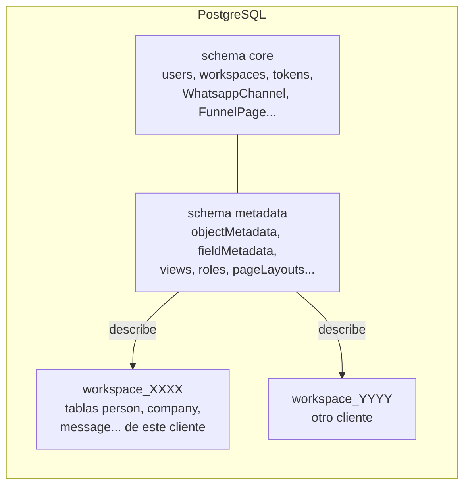
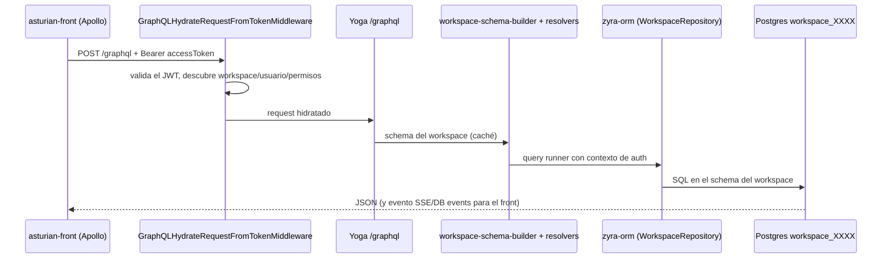
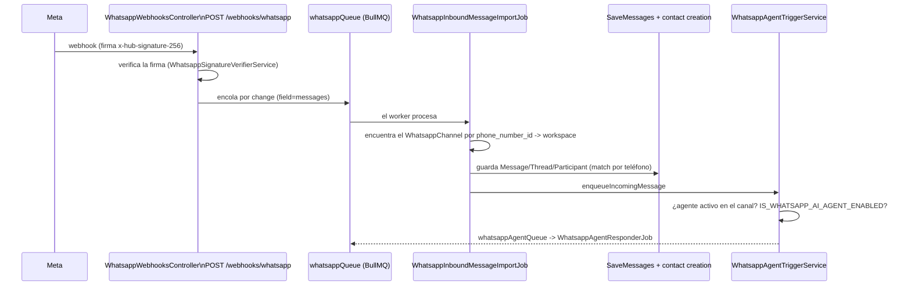

# Cómo funciona Zyra

Guía rápida para quien acaba de entrar al equipo (dev o producto). Todo lo que hay aquí fue verificado en el código; donde algo proviene solo de la memoria operativa del proyecto o de un plan todavía no implementado, eso se indica.

> Nombre: el producto es un CRM white-label (fork de Zyra/Twenty). La UI todavía dice "Zyra"; la marca se cambia en el build mediante `ZYRA_BRAND` (ver [Marca](#marca-white-label)). Los paquetes internos siguen con el prefijo `zyra-*`, excepto el front, renombrado a `asturian-front`.

## 1. Visión general y stack

CRM multi-tenant: cada cliente (workspace) tiene sus propios objetos (Personas, Empresas, Oportunidades, Tareas, Notas, Mensajes...) y el modelo de datos es **configurable en tiempo de ejecución**, no fijo en el código.

| Capa | Tecnología |
|---|---|
| Frontend | React 18, TypeScript, Jotai (estado), Linaria (CSS-in-JS), Apollo Client, Vite |
| Backend | NestJS, TypeORM, PostgreSQL, Redis, GraphQL (Yoga, code-first) |
| Jobs | BullMQ (sobre Redis) |
| Monorepo | Nx + npm workspaces |
| Analytics | ClickHouse (opcional) |

## 2. Mapa de paquetes

```
packages/
├── zyra-server/          API NestJS + worker (el corazón)
├── asturian-front/       App React del CRM (antes zyra-front)
├── zyra-ui/              Biblioteca de componentes visuales compartida
├── zyra-shared/          Tipos, enums y utils comunes (front + back)
├── zyra-emails/          Plantillas de correo transaccional (React Email)
├── zyra-website/         Sitio/landing de marketing (Vite + SSR entry)
├── zyra-docs/            Documentación pública (Mintlify)
├── zyra-funnel/          Solo build estático (assets) de las páginas de funil
├── zyra-front-component-renderer/  Otro paquete; NO es el front (no confundir)
├── zyra-sdk, zyra-client-sdk, zyra-cli, create-zyra-app, zyra-apps  SDK/CLI para apps
├── zyra-oxlint-rules/    Reglas de lint propias (incluye límites de módulo)
├── zyra-zapier, zyra-companion, zyra-codex-plugin, zyra-claude-skills
├── zyra-docker/          Compose de desarrollo
├── zyra-utils/           Scripts (ej.: setup-dev-env.sh)
└── zyra-e2e-testing/     Playwright
```

Otros directorios en la raíz: `brands/` (marcas white-label), `scripts/` (build/deploy de Vercel), `api/index.js` (entrypoint serverless), `docs/` (esta carpeta), `patches/`.

## 3. Backend: cómo está organizado

Código en `packages/zyra-server/src`:

```
main.ts / bootstrap-app.ts   sobe o servidor HTTP (createApp)
serverless.ts                entrypoint para Vercel (mesmo createApp)
queue-worker/                processo separado que consome as filas BullMQ
command/                     CLI Nest (comandos de banco/upgrade/cron)
database/                    TypeORM core, ClickHouse, comandos de banco
engine/                      infraestrutura genérica (o "framework" do CRM)
modules/                     regras de negócio (messaging, whatsapp, person...)
```

### `engine/` (plataforma)

| Carpeta | Rol |
|---|---|
| `engine/core-modules/` | Entidades del schema **core**: auth, user, workspace, billing, message-queue, zyra-config (variables de entorno), feature-flag, file, etc. |
| `engine/metadata-modules/` | Definiciones de metadatos por workspace: `object-metadata`, `field-metadata`, `view`, `page-layout*`, `role*`, `message-channel`, `whatsapp-channel/agent/template`, `funnel-page`, `webhook`, etc. Muchas tienen una versión `flat-*` (caché aplanada). |
| `engine/api/` | Capas de API: `graphql/` (core, metadata, admin-panel), `rest/`, `mcp/` |
| `engine/zyra-orm/` | ORM propio sobre TypeORM, delimitado por workspace (repositorios, entity-manager, query-runner, schema-manager) |
| `engine/workspace-manager/` | Crea/migra el schema de cada workspace y aplica la "standard application" (objetos estándar) |
| `engine/workspace-cache/` y `workspace-cache-storage/` | Caché de los metadatos en Redis |
| `engine/guards/`, `engine/middlewares/` | Autenticación/permisos por request |

### `modules/` (negocio)

`person`, `company`, `opportunity`, `task`, `note`, `messaging`, `calendar`, `connected-account`, `match-participant`, `contact-creation-manager`, `whatsapp`, `whatsapp-webhooks`, `whatsapp-agent`, `instagram*`, `emailing`, `voice-agent`, `workflow`, `dashboard`, `timeline`, `attachment`, `blocklist`, entre otros. Todos registrados en `modules/modules.module.ts`.

## 4. Multi-tenant y modelo de metadatos

Esta es la idea central. Tres "capas" en el mismo Postgres:



- **core**: datos de la plataforma (usuarios, workspaces, claves de API, tokens). Entidades TypeORM normales en `engine/core-modules` y `engine/metadata-modules/*/entities`.
- **metadata**: describe *qué objetos y campos existen* en cada workspace.
- **workspace_<uuid en base36>**: un schema de Postgres por workspace con las tablas reales de los datos. El nombre viene de `engine/workspace-datasource/utils/` (`workspace_${uuidToBase36(workspaceId)}`).

### Los objetos y campos son dinámicos

- Los objetos estándar (Person, Company, Message...) se declaran como `*.workspace-entity.ts` en `modules/*/standard-objects/` y se aplican mediante `engine/workspace-manager/zyra-standard-application`.
- Los objetos/campos personalizados creados por el usuario se convierten en registros en `objectMetadata`/`fieldMetadata`; `workspace-migration` genera el DDL (create table/column) en el schema del workspace.
- El **schema GraphQL de datos se genera por workspace** a partir de estos metadatos: `engine/api/graphql/workspace-schema-builder` (tipos) + `workspace-resolver-builder` (resolvers) + `workspace-schema.factory.ts`. Por eso `/graphql` cambia según el workspace y la caché de metadatos se invalida mediante `workspace-metadata-version`.

### Dos endpoints GraphQL (importante)

Definido en `app.module.ts` (middlewares por ruta `graphql`, `metadata`, `admin-panel`, `mcp`):

| Endpoint | Qué es | Ejemplos |
|---|---|---|
| `/graphql` | API de **datos** del workspace (schema dinámico) | crear/listar personas, empresas, mensajes |
| `/metadata` | API de **plataforma/metadatos** (schema estático) | login (`getLoginTokenFromCredentials`), `renewToken`, `currentUser`, `funnelPages`, `myWhatsappTemplates`, crear objetos/campos/vistas |
| `/admin-panel` | Panel de administración del servidor | |
| `/mcp` | Servidor MCP | |
| REST | `engine/api/rest` (core y metadata) | |

Trampa comprobada: probar una operación de auth/funnel/template en `/graphql` da "Cannot query field..." aunque el servidor esté actualizado. Sondea `/metadata`.

## 5. Flujo de una solicitud (del front a la base de datos)



1. El front (Apollo, `packages/asturian-front/src/modules/apollo`) envía el token de acceso.
2. `engine/middlewares/graphql-hydrate-request-from-token.middleware.ts` llama a `MiddlewareService.hydrateGraphqlRequest` e inyecta workspace/usuario en el request.
3. El schema del workspace viene de la caché (`workspace-cache`), armado a partir de los metadatos.
4. Los resolvers usan el `zyra-orm` (`GlobalWorkspaceOrmManager`, `WorkspaceScopedRepository`), siempre con un `AuthContext` (usuario, API key, aplicación o sistema). Los jobs usan `buildSystemAuthContext(workspaceId)`.
5. Los efectos secundarios se convierten en eventos (`workspace-event-emitter`) que disparan listeners, webhooks, workflows y jobs.

## 6. Frontend (`asturian-front`)

En `packages/asturian-front/src`:

- `modules/` por dominio (`object-record`, `object-metadata`, `views`, `page-layout`, `settings`, `auth`, `funnel`, `people`, `companies`, `workflow`, `ai`...). `pages/` son las pantallas de ruta (`auth`, `funnel`, `object-record`, `onboarding`, `settings`, `page-layout`).
- **Metadatos en el cliente**: `modules/metadata-store` guarda objetos/campos/vistas provenientes de `/metadata`; la UI de registros se arma a partir de ellos, sin pantallas fijas por objeto.
- **Page layouts / widgets**: `modules/page-layout` (widgets en `page-layout/widgets/`: emails, timeline, calendario, campos, etc.) permite configurar la página de detalle de cada objeto. Los tipos de widget viven en `zyra-shared` y, en el backend, en `engine/metadata-modules/page-layout-widget`.
- Estado global: Jotai (atoms/selectors). Caché de datos: Apollo. Estilo: Linaria. i18n: Lingui (`src/locales`).
- Tipos GraphQL generados en `src/generated`, `generated-metadata`, `generated-admin` (`graphql:generate`).
- `zyra-ui` provee los componentes base; `zyra-shared` los tipos comunes.

## 7. Messaging (email y WhatsApp)

Modelo genérico, compartido por todos los canales (objetos estándar en `modules/messaging/common/standard-objects/`):

```mermaid
flowchart TD
  MC[MessageChannel\ntype: EMAIL | SMS | EMAIL_GROUP | WHATSAPP | INSTAGRAM] --> MCMA[MessageChannelMessageAssociation]
  MCMA --> M[Message]
  M --> MT[MessageThread]
  M --> MP[MessageParticipant\nhandle, role, personId, workspaceMemberId]
  MP -.match.-> P[Person]
  MP -.match.-> WM[WorkspaceMember]
```

- `MessageChannelType` está en `zyra-shared/src/types/MessageChannelType.ts`.
- **Email**: se sincroniza con Gmail/Microsoft/IMAP mediante `modules/messaging/message-import-manager` (crons de list-fetch e import, jobs en la `messagingQueue`); el envío está en `message-outbound-manager/drivers/{gmail,microsoft,imap,email-group,whatsapp}`.
- **Participantes**: `MessageParticipant.personId` lo completa `modules/match-participant/match-participant.service.ts` en cada guardado (importación o envío). Si no hay Person, `modules/contact-creation-manager` crea Persona/Empresa (job en la `contactCreationQueue`, según la política `contactAutoCreationPolicy` del canal).
- **Matching por teléfono**: los handles de WhatsApp no tienen `@`. El match usa `Person.phones` (no email) y normaliza el número con `match-participant/utils/normalize-phone-handle-for-matching.ts` (la Person guarda el teléfono sin el código de país `55`; el handle de WhatsApp llega con él). Corrección reciente: commit `964255d0`.
- Cola de eventos: `message-participant-manager/listeners` reaccionan a cambios en Person/WorkspaceMember y rehacen el match mediante un job.

## 8. WhatsApp

Piezas reales en el código:

| Pieza | Ubicación |
|---|---|
| Conexión del número (Embedded Signup de Meta) | `modules/whatsapp` (`connect-whatsapp-number.resolver.ts`, `whatsapp-embedded-signup.service.ts`, `whatsapp-graph-api.service.ts`) |
| Canal/agente/template (metadatos en el schema core) | `engine/metadata-modules/whatsapp-channel`, `whatsapp-agent`, `whatsapp-template` |
| Webhook de entrada | `modules/whatsapp-webhooks` |
| Agente de IA | `modules/whatsapp-agent` (+ entidades en `metadata-modules/whatsapp-agent`) |
| Envío | `modules/messaging/message-outbound-manager/drivers/whatsapp` |
| UI de configuración | `asturian-front/src/modules/settings/accounts/components/SettingsAccountsWhatsapp*` |

Flujo de un mensaje recibido:



- `GET /webhooks/whatsapp` hace el handshake con `WHATSAPP_WEBHOOK_VERIFY_TOKEN`. Los endpoints públicos usan `PublicEndpointGuard` + `NoPermissionGuard`.
- **Agente de IA**: `WhatsappAgentTriggerService` solo actúa si `IS_WHATSAPP_AI_AGENT_ENABLED` está activo y existe un agente `isActive` en el canal; la respuesta corre en un job (`WhatsappAgentResponderService`, cliente de OpenAI en `whatsapp-agent-openai-client.service.ts`, prompt en `...instructions-builder.service.ts`). Requiere `OPENAI_API_KEY`. Guarda su propio historial corto (`WhatsappAgentConversation/Message`).
- Variables: `MESSAGING_PROVIDER_WHATSAPP_ENABLED`, `WHATSAPP_APP_ID`, `WHATSAPP_APP_SECRET`, `WHATSAPP_EMBEDDED_SIGNUP_CONFIGURATION_ID`, `WHATSAPP_WEBHOOK_VERIFY_TOKEN` (en `engine/core-modules/zyra-config/config-variables.ts`).
- **En curso**: bandeja de entrada de WhatsApp (widget en el registro de la Persona + bandeja global + el agente se retira cuando un humano toma el control). Spec/plan: `docs/superpowers/plans/2026-09-28-whatsapp-inbox.md`. Trátalo como un plan, no como una feature terminada, hasta verificarlo en la rama `feat/whatsapp-inbox`.
- Instagram sigue un patrón parecido (`modules/instagram*`, `metadata-modules/instagram-channel`).

## 9. Funnel (funnel-page)

Páginas públicas de captación (workshop, contacto) configuradas en el CRM y servidas sin login.

- Metadatos: `engine/metadata-modules/funnel-page` (entidades `FunnelPage` y `FunnelLead` en el schema core; resolver en `/metadata`, por ejemplo `funnelPages`).
- Público: `funnel-public.controller.ts` (`@Controller('funnel')`), sin auth, identificando el workspace por el id en la URL. Solo sirve páginas **publicadas** y tiene rate limit por IP (`ThrottlerService`).
- Validación: `utils/assert-funnel-page-content-*.util.ts` (tipo de contenido, campos obligatorios para publicar).
- Lead -> CRM: `services/funnel-lead-crm-sync.service.ts` crea una Persona y una Oportunidad mediante `record-crud`, asignadas al actor "Funil" (source WEBHOOK). El slug `contato` genera la oportunidad "Contato"; el resto genera "Workshop". El teléfono se normaliza con `parse-funnel-lead-phone.util.ts`.
- Front: `asturian-front/src/modules/funnel` (editor en Settings, `SalesPageView`, `SignupPageView`, `ConfirmationPageView`) y `pages/funnel`. `packages/zyra-funnel/build` contiene solo assets estáticos.

## 10. Autenticación y permisos

- Login por email/contraseña o SSO (Google, Microsoft, OIDC, SAML en `engine/core-modules/auth/strategies` y `guards`). Flujo: credenciales -> **login token** -> **access token** (JWT) + refresh (`auth/token/services`: `login-token`, `access-token`, `refresh-token`, `renew-token`, `workspace-agnostic-token`...). Operaciones vía `/metadata`.
- Tipos de contexto de auth: usuario, API key, aplicación, sistema (`auth/guards/is-*-auth-context.guard.ts`).
- Guards en `engine/guards`: `WorkspaceAuthGuard`, `UserAuthGuard`, `SettingsPermissionGuard`, `CustomPermissionGuard`, `FeatureFlagGuard`, `PublicEndpointGuard`, `NoPermissionGuard` (marcadores explícitos para endpoints públicos).
- **Permisos**: roles por workspace (`metadata-modules/role`, `role-target`, `object-permission`, `field-permission`, `permission-flag`, `row-level-permission-predicate`), evaluados por `metadata-modules/permissions/permissions.service.ts`. Hay permiso por objeto, por campo y por fila.

## 11. Workers y jobs

- Proceso separado: `npx nx run zyra-server:worker` (`queue-worker/queue-worker.ts` crea solo el `QueueWorkerModule`, con `MessageQueueModule.registerExplorer()`).
- Driver: BullMQ sobre Redis (`message-queue.module-factory.ts` fija `BullMQ`). Existe `sync.driver.ts` para tests.
- Jobs: clases con `@Processor({ queueName })` y `@Process(Nome.name)`; los productores usan `@InjectMessageQueue(MessageQueue.x)` + `messageQueueService.add(...)`.
- Colas (`engine/core-modules/message-queue/message-queue.constants.ts`): `messagingQueue`, `whatsappQueue`, `whatsappAgentQueue`, `instagramQueue`, `contactCreationQueue`, `emailQueue`, `calendarQueue`, `workflowQueue`, `webhookQueue`, `cronQueue`, `aiQueue`, `billingQueue`, `workspaceQueue`, entre otras.
- Crons registrados por `database/commands/cron-register-all.command.ts`.
- Sin el worker corriendo, los webhooks entran pero nada se procesa (los mensajes de WhatsApp no aparecen, el agente no responde).

## 12. Instance commands y workspace commands (upgrade)

Documentación completa: `packages/zyra-server/docs/UPGRADE_COMMANDS.md`.

- **Instance commands**: migraciones de schema/datos a nivel de instancia (reemplazan las migrations crudas de TypeORM). `fast` = schema; `slow` = agrega `runDataMigration` (backfill).
- **Workspace commands**: corren por cada workspace activo/suspendido.
- Decorators `@RegisteredInstanceCommand` / `@RegisteredWorkspaceCommand` (`engine/core-modules/upgrade/decorators`).
- ¿Cambiaste una entidad? Genera: `npx nx run zyra-server:database:migrate:generate --name <nome> --type <fast|slow>`. Siempre incluye `up` y `down`; nunca edites un command ya commiteado; no edites `instance-commands.constant.ts` a mano.
- Versión actual del servidor: `engine/core-modules/upgrade/constants/zyra-current-version.constant.ts` (archivo generado).

## 13. Otros paquetes en una línea

- `zyra-shared`: enums/tipos (`MessageChannelType`, `FieldActorSource`, `WorkspaceActivationStatus`), utils (`isDefined`, `isNonEmptyString`...), build con Vite.
- `zyra-ui`: componentes (`layout`, `input`, `icon`, `theme`, `feedback`...).
- `zyra-emails`: emails transaccionales (`src/emails/*.email.tsx`: invitación, reseteo de contraseña, verificación, workspace suspendido...).
- `zyra-website`: landing pública (`src/sections`, `src/routes`), build mediante `scripts/vercel-build-website.sh`.
- `zyra-docs`: docs públicas en varios idiomas.

### Marca white-label

`ZYRA_BRAND` + `scripts/select-brand.mjs` + `brands/README.md`. Marcas en `brands/{zyra,acme-test,cliente}/brand.config.json`. El build del front (`scripts/vercel-build-front.sh`) aplica la marca. No edites a mano los archivos generados (`index.html`, `Accent*.ts`). `brands/cliente` tiene valores de ejemplo (placeholder).

## 14. Topología de deploy

Confirmado en archivos del repo:
- `vercel.json` (raíz) = config del sitio (`scripts/vercel-build-website.sh`, salida `packages/zyra-website/dist`).
- `vercel.frontend.json` = config de la app del CRM (`scripts/vercel-build-front.sh`, salida `packages/asturian-front/build`, rewrite SPA hacia `/index.html`).
- `vercel.api.json` + `api/index.js` = opción serverless del backend (`serverless.ts`).
- `docs/deploy-vps.md` = guía de VPS con Docker Compose.

Confirmado por la memoria operativa del proyecto (2026-09-26, no verificable solo con el repo):
- **Backend en una VPS vía PM2** (`/root/zyra`), detrás de nginx; **no es Docker** (`deploy-vps.md` está desactualizado en esto). Dos procesos: `zyra-server` y `zyra-worker`.
- **Tres proyectos de Vercel**: sitio (`workshop-os`), app (`workshop-os-app`), docs (`workshop-os-docs`), con la integración de Git **desconectada a propósito**: hacer push no dispara un deploy; el deploy se hace por CLI. Desplegar la app requiere copiar temporalmente `vercel.frontend.json` sobre `vercel.json` y restaurarlo después.
- **Postgres en Supabase y Redis en Upstash, compartidos entre dev y producción.**
- Compilar el servidor en la VPS Linux requiere instalar a mano 3 bindings nativos (el lockfile solo tiene los de Windows):
  ```bash
  npm install @rolldown/binding-linux-x64-gnu @typescript/native-preview-linux-x64 @swc/core-linux-x64-gnu --no-save --no-audit --no-fund
  ```
- Solo el dueño ejecuta comandos en la VPS.

## 15. Cómo ejecutarlo localmente

```bash
# 1x: sobe Postgres + Redis, cria bancos, copia .env, inicializa schema
bash packages/zyra-utils/setup-dev-env.sh        # --docker | --down | --reset

npm run dev                       # server + front (porta 3001) + worker
npx nx start zyra-server          # só backend
npx nx start asturian-front       # só front
npx nx run zyra-server:worker     # só worker

# testes (prefira arquivo único)
npx jest caminho/arquivo.spec.ts --config=packages/zyra-server/jest.config.mjs

# qualidade
npx nx lint:diff-with-main zyra-server
npx nx typecheck zyra-server
npx nx run asturian-front:graphql:generate --configuration=metadata   # após mudar schema

npx nx build zyra-shared          # zyra-shared antes de buildar o resto
```

Para probar la UI de punta a punta: "Continue with Email" y usar las credenciales precargadas.

## 16. Convenciones principales

Resumen del `CLAUDE.md` (lee el original):
- Solo componentes funcionales; solo named exports; `type` en lugar de `interface`; string literals en lugar de enums (excepto GraphQL); nada de `any`.
- Nombres sin abreviar (`fieldMetadata`, no `fm`); archivos en kebab-case con sufijo (`.service.ts`, `.entity.ts`, `.resolver.ts`, `.component.tsx`).
- Preferir event handlers sobre `useEffect`; Jotai para el estado global; Linaria para el estilo; Lingui para i18n.
- Componentes < 300 líneas, servicios < 500.
- Comentarios cortos con `//`, explicando el porqué.
- Usar `isDefined`, `isNonEmptyString`, `isNonEmptyArray` de `zyra-shared/utils`.
- Repositorios de workspace mediante `WorkspaceScopedRepository` (regla de lint `zyra/prefer-workspace-scoped-repository`; las excepciones necesitan un `eslint-disable` justificado, como en el import de WhatsApp que todavía no conoce el workspace).
- ¿Cambiaste una entidad? -> instance command. ¿Cambiaste el schema de GraphQL? -> `graphql:generate` y mantén la retrocompatibilidad.
- Tests: comportamiento, no implementación; nombres "should X when Y".

## 17. Trampas conocidas

1. **`/graphql` vs `/metadata`**: auth, funnel, templates de WhatsApp y metadatos están en `/metadata`. No concluyas "backend desactualizado" sin sondear el endpoint correcto.
2. **`zyra-front` vs `zyra-front-component-renderer`**: el front fue renombrado a `asturian-front`; el renderer es otro paquete. En búsquedas y reemplazos, protege `zyra-front-component-renderer`.
3. **Base de datos compartida**: dev y prod usan el mismo Supabase/Upstash (memoria del proyecto). No corras migrations desde tu notebook; la URL local de Supabase puede ser rechazada y un error aquí afecta a producción.
4. **Worker detenido = mensajería detenida**: el webhook responde 200 pero la importación corre en la cola.
5. **El handle de WhatsApp no es un email**: siempre pásalo por `normalizePhoneHandleForMatching`; nunca guardes un teléfono en `emails`.
6. **Endpoints públicos** (`/funnel`, `/webhooks/whatsapp`) no tienen sesión: exigen rate limit, validación de firma y `PublicEndpointGuard`.
7. **El deploy del front en Vercel** cambia `vercel.json` temporalmente; restáuralo con `git checkout -- vercel.json` (y `.gitignore`, que la CLI ensucia). Nunca corras dos deploys al mismo tiempo.
8. **Lockfile solo de Windows**: el build en la VPS falla sin los bindings nativos manuales (sección 14).
9. **Máquina local Windows**: Nx puede trabarse (usa `npx tsgo`, `oxlint`, `jest` directamente); Grep/Glob sobre toda la raíz dan timeout (busca dentro de subcarpetas); `tsgo --noEmit` en el front genera miles de errores si `zyra-ui` no está compilado. El build real de verificación es el de Vercel.
10. **`docs/deploy-vps.md` está desactualizado** (habla de Docker; producción usa PM2).
11. **Renombrar "Zyra"**: solo se cambió la marca visible; los paquetes `zyra-*`, los imports y `CLAUDE.md` mantienen el nombre anterior por decisión. Confirma el alcance antes de ampliarlo.
12. **Archivos generados** (`src/generated*`, `zyra-current-version.constant.ts`, `instance-commands.constant.ts`, marca): no los edites a mano.

## 18. Por dónde empezar a leer

1. `packages/zyra-server/src/app.module.ts` (qué está conectado y en qué rutas).
2. `engine/api/graphql/workspace-schema-builder` (cómo los metadatos se convierten en GraphQL).
3. `modules/whatsapp-webhooks` -> `modules/messaging/message-import-manager` -> `modules/match-participant` (un flujo completo de punta a punta).
4. `packages/asturian-front/src/modules/page-layout` y `object-record` (cómo se arma la UI a partir de los metadatos).
5. `packages/zyra-server/docs/UPGRADE_COMMANDS.md` y `CLAUDE.md`.
