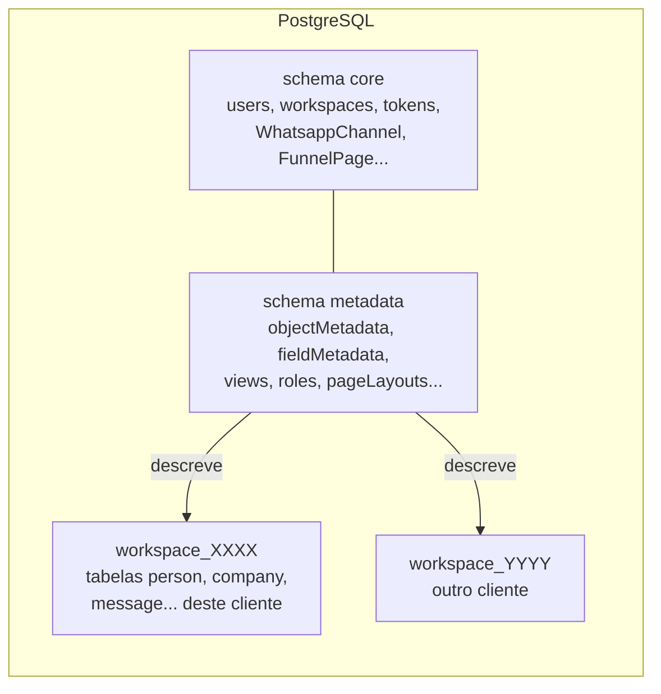
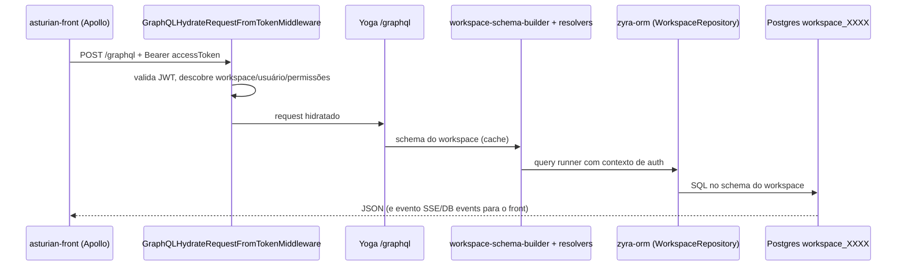
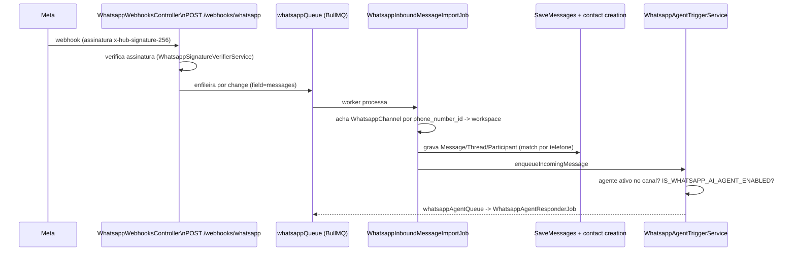

# Como o Zyra funciona

Guia rápido para quem acabou de entrar no time (dev ou produto). Tudo aqui foi conferido no código; onde algo vem só da memória de operação do projeto ou de um plano ainda não implementado, isso está dito.

> Nome: o produto é um CRM white-label (fork do Zyra/Twenty). A UI ainda diz "Zyra"; a marca é trocada em build via `ZYRA_BRAND` (ver [Marca](#marca-white-label)). Os pacotes internos continuam com prefixo `zyra-*`, exceto o front, renomeado para `asturian-front`.

## 1. Visão geral e stack

CRM multi-tenant: cada cliente (workspace) tem seus próprios objetos (Pessoas, Empresas, Oportunidades, Tarefas, Notas, Mensagens...) e o modelo de dados é **configurável em runtime**, não fixo no código.

| Camada | Tecnologia |
|---|---|
| Frontend | React 18, TypeScript, Jotai (estado), Linaria (CSS-in-JS), Apollo Client, Vite |
| Backend | NestJS, TypeORM, PostgreSQL, Redis, GraphQL (Yoga, code-first) |
| Jobs | BullMQ (sobre Redis) |
| Monorepo | Nx + npm workspaces |
| Analytics | ClickHouse (opcional) |

## 2. Mapa de pacotes

```
packages/
├── zyra-server/          API NestJS + worker (o coração)
├── asturian-front/       App React do CRM (antigo zyra-front)
├── zyra-ui/              Biblioteca de componentes visuais compartilhada
├── zyra-shared/          Tipos, enums e utils comuns (front + back)
├── zyra-emails/          Templates de e-mail transacional (React Email)
├── zyra-website/         Site/landing de marketing (Vite + SSR entry)
├── zyra-docs/            Documentação pública (Mintlify)
├── zyra-funnel/          Apenas build estático (assets) das páginas de funil
├── zyra-front-component-renderer/  Outro pacote; NÃO é o front (não confundir)
├── zyra-sdk, zyra-client-sdk, zyra-cli, create-zyra-app, zyra-apps  SDK/CLI para apps
├── zyra-oxlint-rules/    Regras de lint próprias (inclui limites de módulo)
├── zyra-zapier, zyra-companion, zyra-codex-plugin, zyra-claude-skills
├── zyra-docker/          Compose de desenvolvimento
├── zyra-utils/           Scripts (ex.: setup-dev-env.sh)
└── zyra-e2e-testing/     Playwright
```

Outros diretórios na raiz: `brands/` (marcas white-label), `scripts/` (build/deploy Vercel), `api/index.js` (entrypoint serverless), `docs/` (esta pasta), `patches/`.

## 3. Backend: como é organizado

Código em `packages/zyra-server/src`:

```
main.ts / bootstrap-app.ts   sobe o servidor HTTP (createApp)
serverless.ts                entrypoint para Vercel (mesmo createApp)
queue-worker/                processo separado que consome as filas BullMQ
command/                     CLI Nest (comandos de banco/upgrade/cron)
database/                    TypeORM core, ClickHouse, comandos de banco
engine/                      infraestrutura genérica (o "framework" do CRM)
modules/                     regras de negócio (messaging, whatsapp, person...)
```

### `engine/` (plataforma)

| Pasta | Papel |
|---|---|
| `engine/core-modules/` | Entidades do schema **core**: auth, user, workspace, billing, message-queue, zyra-config (variáveis de ambiente), feature-flag, file, etc. |
| `engine/metadata-modules/` | Definições de metadados por workspace: `object-metadata`, `field-metadata`, `view`, `page-layout*`, `role*`, `message-channel`, `whatsapp-channel/agent/template`, `funnel-page`, `webhook`, etc. Muitos têm versão `flat-*` (cache achatado). |
| `engine/api/` | Camadas de API: `graphql/` (core, metadata, admin-panel), `rest/`, `mcp/` |
| `engine/zyra-orm/` | ORM próprio por cima do TypeORM, escopado por workspace (repositórios, entity-manager, query-runner, schema-manager) |
| `engine/workspace-manager/` | Cria/migra o schema de cada workspace e aplica a "standard application" (objetos padrão) |
| `engine/workspace-cache/` e `workspace-cache-storage/` | Cache dos metadados em Redis |
| `engine/guards/`, `engine/middlewares/` | Autenticação/permissão por request |

### `modules/` (negócio)

`person`, `company`, `opportunity`, `task`, `note`, `messaging`, `calendar`, `connected-account`, `match-participant`, `contact-creation-manager`, `whatsapp`, `whatsapp-webhooks`, `whatsapp-agent`, `instagram*`, `emailing`, `voice-agent`, `workflow`, `dashboard`, `timeline`, `attachment`, `blocklist`, entre outros. Todos registrados em `modules/modules.module.ts`.

## 4. Multi-tenant e modelo de metadados

Esta é a ideia central. Três "camadas" no mesmo Postgres:



- **core**: dados da plataforma (usuários, workspaces, chaves de API, tokens). Entidades TypeORM normais em `engine/core-modules` e `engine/metadata-modules/*/entities`.
- **metadata**: descreve *quais objetos e campos existem* em cada workspace.
- **workspace_<uuid em base36>**: um schema Postgres por workspace com as tabelas reais dos dados. O nome vem de `engine/workspace-datasource/utils/` (`workspace_${uuidToBase36(workspaceId)}`).

### Objetos e campos são dinâmicos

- Os objetos padrão (Person, Company, Message...) são declarados como `*.workspace-entity.ts` em `modules/*/standard-objects/` e aplicados por `engine/workspace-manager/zyra-standard-application`.
- Objetos/campos customizados criados pelo usuário viram registros em `objectMetadata`/`fieldMetadata`; o `workspace-migration` gera o DDL (create table/column) no schema do workspace.
- O **schema GraphQL de dados é gerado por workspace** a partir desses metadados: `engine/api/graphql/workspace-schema-builder` (tipos) + `workspace-resolver-builder` (resolvers) + `workspace-schema.factory.ts`. Por isso `/graphql` muda conforme o workspace e o cache de metadados é invalidado via `workspace-metadata-version`.

### Dois endpoints GraphQL (importante)

Definido em `app.module.ts` (middlewares por rota `graphql`, `metadata`, `admin-panel`, `mcp`):

| Endpoint | O que é | Exemplos |
|---|---|---|
| `/graphql` | API de **dados** do workspace (schema dinâmico) | criar/listar pessoas, empresas, mensagens |
| `/metadata` | API de **plataforma/metadados** (schema estático) | login (`getLoginTokenFromCredentials`), `renewToken`, `currentUser`, `funnelPages`, `myWhatsappTemplates`, criar objetos/campos/views |
| `/admin-panel` | Painel de admin do servidor | |
| `/mcp` | Servidor MCP | |
| REST | `engine/api/rest` (core e metadata) | |

Armadilha comprovada: testar uma operação de auth/funil/template em `/graphql` dá "Cannot query field..." mesmo com o servidor atualizado. Sonde `/metadata`.

## 5. Fluxo de uma requisição (front até o banco)



1. O front (Apollo, `packages/asturian-front/src/modules/apollo`) envia o token de acesso.
2. `engine/middlewares/graphql-hydrate-request-from-token.middleware.ts` chama `MiddlewareService.hydrateGraphqlRequest` e injeta workspace/usuário no request.
3. O schema do workspace vem do cache (`workspace-cache`), montado a partir dos metadados.
4. Resolvers usam o `zyra-orm` (`GlobalWorkspaceOrmManager`, `WorkspaceScopedRepository`), sempre com um `AuthContext` (usuário, API key, aplicação ou sistema). Jobs usam `buildSystemAuthContext(workspaceId)`.
5. Efeitos colaterais viram eventos (`workspace-event-emitter`) que disparam listeners, webhooks, workflows e jobs.

## 6. Frontend (`asturian-front`)

Em `packages/asturian-front/src`:

- `modules/` por domínio (`object-record`, `object-metadata`, `views`, `page-layout`, `settings`, `auth`, `funnel`, `people`, `companies`, `workflow`, `ai`...). `pages/` são as telas de rota (`auth`, `funnel`, `object-record`, `onboarding`, `settings`, `page-layout`).
- **Metadados no cliente**: `modules/metadata-store` guarda objetos/campos/views vindos de `/metadata`; a UI de registros é montada a partir deles, sem telas fixas por objeto.
- **Page layouts / widgets**: `modules/page-layout` (widgets em `page-layout/widgets/`: emails, timeline, calendar, campos, etc.) permite configurar a página de detalhe de cada objeto. Tipos de widget vivem em `zyra-shared` e no back em `engine/metadata-modules/page-layout-widget`.
- Estado global: Jotai (atoms/selectors). Cache de dados: Apollo. Estilo: Linaria. i18n: Lingui (`src/locales`).
- Tipos GraphQL gerados em `src/generated`, `generated-metadata`, `generated-admin` (`graphql:generate`).
- `zyra-ui` fornece os componentes base; `zyra-shared` os tipos comuns.

## 7. Messaging (e-mail e WhatsApp)

Modelo genérico, compartilhado por todos os canais (objetos padrão em `modules/messaging/common/standard-objects/`):

```mermaid
flowchart TD
  MC[MessageChannel\ntype: EMAIL | SMS | EMAIL_GROUP | WHATSAPP | INSTAGRAM] --> MCMA[MessageChannelMessageAssociation]
  MCMA --> M[Message]
  M --> MT[MessageThread]
  M --> MP[MessageParticipant\nhandle, role, personId, workspaceMemberId]
  MP -.match.-> P[Person]
  MP -.match.-> WM[WorkspaceMember]
```

- `MessageChannelType` está em `zyra-shared/src/types/MessageChannelType.ts`.
- **E-mail**: sincroniza com Gmail/Microsoft/IMAP via `modules/messaging/message-import-manager` (crons de list-fetch e import, jobs na `messagingQueue`); envio em `message-outbound-manager/drivers/{gmail,microsoft,imap,email-group,whatsapp}`.
- **Participantes**: `MessageParticipant.personId` é preenchido por `modules/match-participant/match-participant.service.ts` a cada salvamento (importação ou envio). Se não há Person, `modules/contact-creation-manager` cria Pessoa/Empresa (job na `contactCreationQueue`, conforme a política `contactAutoCreationPolicy` do canal).
- **Matching por telefone**: handles de WhatsApp não têm `@`. O match usa `Person.phones` (não e-mail) e normaliza o número com `match-participant/utils/normalize-phone-handle-for-matching.ts` (a Person guarda o telefone sem o DDI `55`; o handle do WhatsApp chega com ele). Correção recente: commit `964255d0`.
- Fila de eventos: `message-participant-manager/listeners` reagem a mudanças em Person/WorkspaceMember e refazem o match via job.

## 8. WhatsApp

Peças reais no código:

| Peça | Onde |
|---|---|
| Conexão do número (Embedded Signup da Meta) | `modules/whatsapp` (`connect-whatsapp-number.resolver.ts`, `whatsapp-embedded-signup.service.ts`, `whatsapp-graph-api.service.ts`) |
| Canal/agente/template (metadados no schema core) | `engine/metadata-modules/whatsapp-channel`, `whatsapp-agent`, `whatsapp-template` |
| Webhook de entrada | `modules/whatsapp-webhooks` |
| Agente de IA | `modules/whatsapp-agent` (+ entidades em `metadata-modules/whatsapp-agent`) |
| Envio | `modules/messaging/message-outbound-manager/drivers/whatsapp` |
| UI de configuração | `asturian-front/src/modules/settings/accounts/components/SettingsAccountsWhatsapp*` |

Fluxo de mensagem recebida:



- O `GET /webhooks/whatsapp` faz o handshake com `WHATSAPP_WEBHOOK_VERIFY_TOKEN`. Endpoints públicos usam `PublicEndpointGuard` + `NoPermissionGuard`.
- **Agente de IA**: `WhatsappAgentTriggerService` só age se `IS_WHATSAPP_AI_AGENT_ENABLED` e existir um agente `isActive` no canal; a resposta roda em job (`WhatsappAgentResponderService`, cliente OpenAI em `whatsapp-agent-openai-client.service.ts`, prompt em `...instructions-builder.service.ts`). Requer `OPENAI_API_KEY`. Guarda histórico curto próprio (`WhatsappAgentConversation/Message`).
- Variáveis: `MESSAGING_PROVIDER_WHATSAPP_ENABLED`, `WHATSAPP_APP_ID`, `WHATSAPP_APP_SECRET`, `WHATSAPP_EMBEDDED_SIGNUP_CONFIGURATION_ID`, `WHATSAPP_WEBHOOK_VERIFY_TOKEN` (em `engine/core-modules/zyra-config/config-variables.ts`).
- **Em andamento**: inbox de WhatsApp (widget no registro da Pessoa + inbox global + agente recuar quando humano assume). Spec/plano: `docs/superpowers/plans/2026-09-28-whatsapp-inbox.md`. Trate como plano, não como feature pronta, até conferir na branch `feat/whatsapp-inbox`.
- Instagram segue padrão parecido (`modules/instagram*`, `metadata-modules/instagram-channel`).

## 9. Funil (funnel-page)

Páginas públicas de captura (workshop, contato) configuradas no CRM e servidas sem login.

- Metadados: `engine/metadata-modules/funnel-page` (entidades `FunnelPage` e `FunnelLead` no schema core; resolver em `/metadata`, ex. `funnelPages`).
- Público: `funnel-public.controller.ts` (`@Controller('funnel')`), sem auth, identificando o workspace pelo id na URL. Só serve páginas **publicadas** e tem rate limit por IP (`ThrottlerService`).
- Validação: `utils/assert-funnel-page-content-*.util.ts` (tipo do conteúdo, campos obrigatórios para publicar).
- Lead -> CRM: `services/funnel-lead-crm-sync.service.ts` cria Pessoa e Oportunidade via `record-crud`, atribuídas ao ator "Funil" (source WEBHOOK). Slug `contato` gera oportunidade "Contato"; as demais, "Workshop". Telefone normalizado por `parse-funnel-lead-phone.util.ts`.
- Front: `asturian-front/src/modules/funnel` (editor em Settings, `SalesPageView`, `SignupPageView`, `ConfirmationPageView`) e `pages/funnel`. `packages/zyra-funnel/build` contém apenas assets estáticos.

## 10. Autenticação e permissões

- Login por e-mail/senha ou SSO (Google, Microsoft, OIDC, SAML em `engine/core-modules/auth/strategies` e `guards`). Fluxo: credenciais -> **login token** -> **access token** (JWT) + refresh (`auth/token/services`: `login-token`, `access-token`, `refresh-token`, `renew-token`, `workspace-agnostic-token`...). Operações via `/metadata`.
- Tipos de contexto de auth: usuário, API key, aplicação, sistema (`auth/guards/is-*-auth-context.guard.ts`).
- Guards em `engine/guards`: `WorkspaceAuthGuard`, `UserAuthGuard`, `SettingsPermissionGuard`, `CustomPermissionGuard`, `FeatureFlagGuard`, `PublicEndpointGuard`, `NoPermissionGuard` (marcadores explícitos para endpoints públicos).
- **Permissões**: roles por workspace (`metadata-modules/role`, `role-target`, `object-permission`, `field-permission`, `permission-flag`, `row-level-permission-predicate`), avaliadas por `metadata-modules/permissions/permissions.service.ts`. Há permissão por objeto, por campo e por linha.

## 11. Workers e jobs

- Processo separado: `npx nx run zyra-server:worker` (`queue-worker/queue-worker.ts` cria só o `QueueWorkerModule`, com `MessageQueueModule.registerExplorer()`).
- Driver: BullMQ sobre Redis (`message-queue.module-factory.ts` fixa `BullMQ`). Existe `sync.driver.ts` para testes.
- Jobs: classes com `@Processor({ queueName })` e `@Process(Nome.name)`; produtores usam `@InjectMessageQueue(MessageQueue.x)` + `messageQueueService.add(...)`.
- Filas (`engine/core-modules/message-queue/message-queue.constants.ts`): `messagingQueue`, `whatsappQueue`, `whatsappAgentQueue`, `instagramQueue`, `contactCreationQueue`, `emailQueue`, `calendarQueue`, `workflowQueue`, `webhookQueue`, `cronQueue`, `aiQueue`, `billingQueue`, `workspaceQueue`, entre outras.
- Crons registrados por `database/commands/cron-register-all.command.ts`.
- Sem o worker rodando, webhooks entram mas nada é processado (mensagens de WhatsApp não aparecem, agente não responde).

## 12. Instance commands e workspace commands (upgrade)

Documentação completa: `packages/zyra-server/docs/UPGRADE_COMMANDS.md`.

- **Instance commands**: migrações de schema/dados no nível da instância (substituem migrations TypeORM cruas). `fast` = schema; `slow` = adiciona `runDataMigration` (backfill).
- **Workspace commands**: rodam por workspace ativo/suspenso.
- Decorators `@RegisteredInstanceCommand` / `@RegisteredWorkspaceCommand` (`engine/core-modules/upgrade/decorators`).
- Mudou uma entidade? Gere: `npx nx run zyra-server:database:migrate:generate --name <nome> --type <fast|slow>`. Sempre `up` e `down`; nunca edite um command já commitado; não edite `instance-commands.constant.ts` na mão.
- Versão atual do servidor: `engine/core-modules/upgrade/constants/zyra-current-version.constant.ts` (arquivo gerado).

## 13. Outros pacotes em uma linha

- `zyra-shared`: enums/tipos (`MessageChannelType`, `FieldActorSource`, `WorkspaceActivationStatus`), utils (`isDefined`, `isNonEmptyString`...), build em Vite.
- `zyra-ui`: componentes (`layout`, `input`, `icon`, `theme`, `feedback`...).
- `zyra-emails`: e-mails transacionais (`src/emails/*.email.tsx`: convite, reset de senha, verificação, workspace suspenso...).
- `zyra-website`: landing pública (`src/sections`, `src/routes`), build por `scripts/vercel-build-website.sh`.
- `zyra-docs`: docs públicas em várias línguas.

### Marca white-label

`ZYRA_BRAND` + `scripts/select-brand.mjs` + `brands/README.md`. Marcas em `brands/{zyra,acme-test,cliente}/brand.config.json`. O build do front (`scripts/vercel-build-front.sh`) aplica a marca. Não edite à mão os arquivos gerados (`index.html`, `Accent*.ts`). O `brands/cliente` tem valores placeholder.

## 14. Topologia de deploy

Confirmado em arquivos do repo:
- `vercel.json` (raiz) = config do site (`scripts/vercel-build-website.sh`, saída `packages/zyra-website/dist`).
- `vercel.frontend.json` = config do app CRM (`scripts/vercel-build-front.sh`, saída `packages/asturian-front/build`, rewrite SPA para `/index.html`).
- `vercel.api.json` + `api/index.js` = opção serverless do backend (`serverless.ts`).
- `docs/deploy-vps.md` = guia de VPS com Docker Compose.

Confirmado pela memória de operação do projeto (2026-09-26, não verificável só pelo repo):
- **Backend em VPS via PM2** (`/root/zyra`), atrás de nginx; **não é Docker** (o `deploy-vps.md` está desatualizado nisso). Dois processos: `zyra-server` e `zyra-worker`.
- **Três projetos Vercel**: site (`workshop-os`), app (`workshop-os-app`), docs (`workshop-os-docs`), com integração Git **desconectada de propósito**: push não faz deploy; deploy é por CLI. O deploy do app exige copiar `vercel.frontend.json` sobre `vercel.json` temporariamente e restaurar depois.
- **Postgres no Supabase e Redis no Upstash, compartilhados entre dev e produção.**
- Build do servidor na VPS Linux precisa instalar à mão 3 bindings nativos (o lockfile só tem os de Windows):
  ```bash
  npm install @rolldown/binding-linux-x64-gnu @typescript/native-preview-linux-x64 @swc/core-linux-x64-gnu --no-save --no-audit --no-fund
  ```
- Só o dono roda comandos na VPS.

## 15. Como rodar localmente

```bash
# 1x: sobe Postgres + Redis, cria bancos, copia .env, inicializa schema
bash packages/zyra-utils/setup-dev-env.sh        # --docker | --down | --reset

npm run dev                       # server + front (porta 3001) + worker
npx nx start zyra-server          # só backend
npx nx start asturian-front       # só front
npx nx run zyra-server:worker     # só worker

# testes (prefira arquivo único)
npx jest caminho/arquivo.spec.ts --config=packages/zyra-server/jest.config.mjs

# qualidade
npx nx lint:diff-with-main zyra-server
npx nx typecheck zyra-server
npx nx run asturian-front:graphql:generate --configuration=metadata   # após mudar schema

npx nx build zyra-shared          # zyra-shared antes de buildar o resto
```

Para testar a UI ponta a ponta: "Continue with Email" e usar as credenciais pré-preenchidas.

## 16. Convenções principais

Resumo do `CLAUDE.md` (leia o original):
- Só componentes funcionais; só named exports; `type` em vez de `interface`; string literals em vez de enums (exceto GraphQL); nada de `any`.
- Nomes sem abreviação (`fieldMetadata`, não `fm`); arquivos em kebab-case com sufixo (`.service.ts`, `.entity.ts`, `.resolver.ts`, `.component.tsx`).
- Prefira event handlers a `useEffect`; Jotai para estado global; Linaria para estilo; Lingui para i18n.
- Componentes < 300 linhas, serviços < 500.
- Comentários curtos com `//`, explicando o porquê.
- Use `isDefined`, `isNonEmptyString`, `isNonEmptyArray` de `zyra-shared/utils`.
- Repositórios de workspace via `WorkspaceScopedRepository` (regra de lint `zyra/prefer-workspace-scoped-repository`; exceções precisam de `eslint-disable` justificado, como no import de WhatsApp que ainda não sabe o workspace).
- Mudou entidade -> instance command. Mudou schema GraphQL -> `graphql:generate` e mantenha retrocompatibilidade.
- Testes: comportamento, não implementação; nomes "should X when Y".

## 17. Armadilhas conhecidas

1. **`/graphql` vs `/metadata`**: auth, funil, templates de WhatsApp e metadados ficam em `/metadata`. Não conclua "backend desatualizado" sem sondar o endpoint certo.
2. **`zyra-front` vs `zyra-front-component-renderer`**: o front foi renomeado para `asturian-front`; o renderer é outro pacote. Em buscas e substituições, proteja `zyra-front-component-renderer`.
3. **Banco compartilhado**: dev e prod usam o mesmo Supabase/Upstash (memória do projeto). Não rode migrations do seu notebook; a URL local do Supabase pode ser rejeitada e um erro aqui afeta produção.
4. **Worker parado = mensageria parada**: webhook responde 200 mas o import roda na fila.
5. **Handle de WhatsApp não é e-mail**: sempre passe por `normalizePhoneHandleForMatching`; nunca grave telefone em `emails`.
6. **Endpoints públicos** (`/funnel`, `/webhooks/whatsapp`) não têm sessão: exigem rate limit, validação de assinatura e `PublicEndpointGuard`.
7. **Deploy do front na Vercel** troca `vercel.json` temporariamente; restaure com `git checkout -- vercel.json` (e `.gitignore`, que a CLI suja). Nunca rode dois deploys ao mesmo tempo.
8. **Lockfile só Windows**: build na VPS falha sem os bindings nativos manuais (seção 14).
9. **Máquina local Windows**: Nx pode travar (use `npx tsgo`, `oxlint`, `jest` direto); Grep/Glob na raiz inteira dão timeout (busque em subpastas); `tsgo --noEmit` no front gera milhares de erros se `zyra-ui` não estiver buildado. O build real de verificação é o da Vercel.
10. **`docs/deploy-vps.md` está defasado** (fala de Docker; a produção usa PM2).
11. **Renomear "Zyra"**: só marca visível foi trocada; pacotes `zyra-*`, imports e `CLAUDE.md` seguem com o nome antigo por decisão. Confirme escopo antes de ampliar.
12. **Arquivos gerados** (`src/generated*`, `zyra-current-version.constant.ts`, `instance-commands.constant.ts`, marca): não edite à mão.

## 18. Por onde começar a ler

1. `packages/zyra-server/src/app.module.ts` (o que está ligado e em quais rotas).
2. `engine/api/graphql/workspace-schema-builder` (como metadados viram GraphQL).
3. `modules/whatsapp-webhooks` -> `modules/messaging/message-import-manager` -> `modules/match-participant` (um fluxo completo de ponta a ponta).
4. `packages/asturian-front/src/modules/page-layout` e `object-record` (como a UI é montada a partir dos metadados).
5. `packages/zyra-server/docs/UPGRADE_COMMANDS.md` e `CLAUDE.md`.
